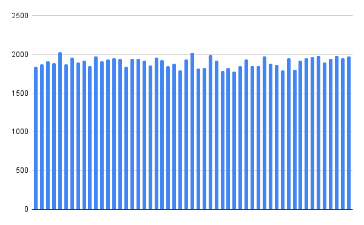

# 📊 Tabela Hash com Encadeamento e Ordenação – Projeto Final de ED I

### 📌 Disciplina
- Estrutura de Dados I  
- Instituto Federal Catarinense – Campus Videira  
- Curso: Ciências da Computação

### 👨‍🎓 Aluno
- Guilherme Pereira do Amarilho  
- Professor: Manasses Ribeiro

---

## 📘 Sobre o Projeto

Este projeto foi desenvolvido como **trabalho final da disciplina**, com o objetivo de agrupar, distribuir e organizar eficientemente uma grande massa de dados: uma base de **100.000 nomes brasileiros**.

---

## 🎯 Objetivos

- Criar uma **Tabela Hash com encadeamento**
- Implementar funções de **inserção, remoção, busca, ordenação e contagem**
- Tratar **colisões** com listas encadeadas duplas
- Garantir boa distribuição com uma **função hash personalizada**
- Ordenar listas com **QuickSort**
- Gerar **histograma da distribuição** dos nomes por chave

---

## 🧠 Metodologia

### 🔢 1. Função Hash

Utilizamos a fórmula: 
(caractere1 * 1 + caractere2 * 2 + ... + caractereN * N) % 53

Ela foi escolhida por promover melhor dispersão dos dados com base nos pesos dos caracteres, se aproximando da hipótese do **hash uniforme**.

### 🔁 2. Tratamento de Colisões

Foi utilizado **encadeamento com listas duplamente encadeadas** para cada chave. Isso garante que todas as colisões sejam resolvidas de forma eficiente e sem limitação de tamanho.

### 📊 3. Análise do Hash Uniforme



O histograma mostra a quantidade de nomes armazenados em cada uma das 53 chaves.  
- Média: ~1901 nomes por chave  
- Desvio padrão: 64  
Isso indica uma **distribuição próxima da uniformidade**, validando a eficiência da função hash.

### 🔃 4. Ordenação com QuickSort

Cada lista encadeada é ordenada individualmente utilizando o algoritmo **QuickSort**, adaptado para ponteiros em listas duplas. Isso facilita buscas e visualização posteriores.


---

## ⚙️ Funcionalidades do Sistema

- 📥 **Inserção** de novos nomes
- 🔍 **Busca** por nome
- ❌ **Remoção** de elementos
- 📄 **Impressão** de uma lista por chave
- 📈 **Contagem** de elementos por chave
- 🧮 **Ordenação** das listas com QuickSort
- 📤 **Leitura de arquivo** com os nomes
- 📊 **Geração de gráfico de distribuição (`grafico.txt`)**

---

## 🧩 Estrutura do Código

```text
.
├── main.c                   # Código-fonte principal
├── nomes.txt                # Arquivo com os nomes (externo, fornecido)
├── grafico.txt              # Arquivo gerado com a frequência por chave
├── histograma.png           # Imagem da distribuição gerada
├── QuickSort.gif            # Ilustração do método de ordenação
├── Problema Trabalho Final ED.pdf   # Descritivo com regras e objetivos do professor
├── README.md                # Relatório e documentação do projeto
```

---

> 📚 “Organizar bem os dados é o primeiro passo para pensar melhor sobre eles.”